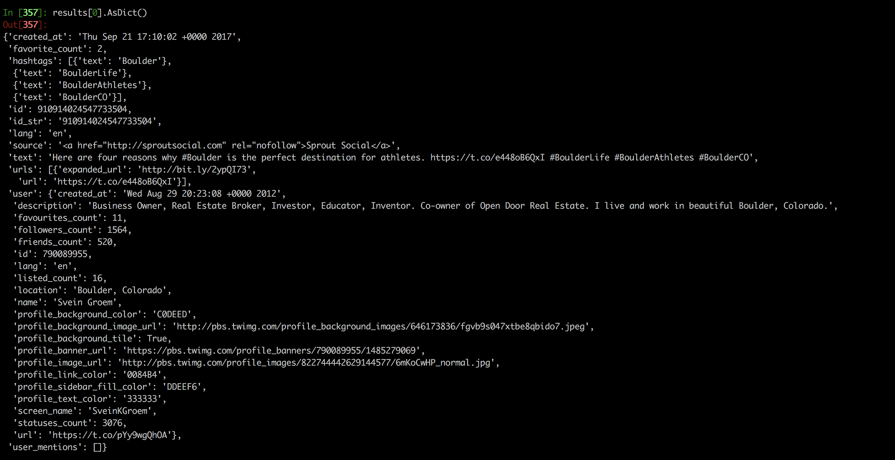
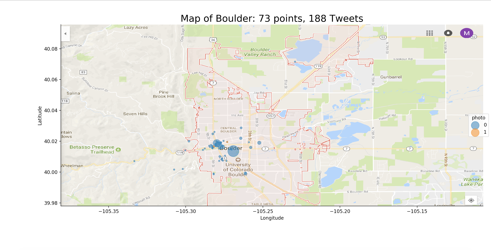

# BoulderView
In coordination with the City Of Boulder, I will be using Twitter to predict where photos are being taken, based on the text associated with the picture. 

## Table of Contents
1. [Early Steps](#early-steps)
   * [Gathering Data](#gathering-data)
   * [Building The Dataset](#building-the-dataset)
   * [EDA](#eda)

## Early Steps
Originally, I was going to be using A database from the City Of Boulder, but none of the files contained Geocode information. I investigated the APIs of Facebook, Twitter, and Instagram. Facebook wasn't allowing access at the time, and I still haven't heard back from Instagram, but Twitter has been extremely helpful. The API is very easy to us, and provides a wealth of information.

### Gathering Data
Pulling Data every hour, and loading it into a .txt file, gaining roughly 1000 lines at each pull. Much of this data would be missing information, such as latitude/longitude.

### Building The Dataset
After each pull, new data would be added into the dataframe, with any repeats being omitted. The fetures I'm using are as follows:
* **ID**: The Tweet ID
* **Type**: Picture, Video, Animated Gif, Other
* **Pic_link**: the link to the picture, if applicable
* **Longitude**: The longitude of the tweet
* **Latitude**: The latitude of the tweet
* **Text**: The text associated with the tweet
* **Hashtags**: The hashtags associated with the tweet
* **Created_At**: The date/time when the tweet was posted
* **Coordinates**: the longitude/latitude coordinates of the tweet

## EDA
Dropping all rows where coordinates were NaN, and then grouping the dataframe by coordinates, and getting the count of each feature. Then plotting the results over a map of Boulder, with the size of each marker indicating the number of tweets sent from each location. This created a new dataframe called df_coords, containing the counts of the Type column ("Photo or "Not Photo"). 

Made with [Seaborn](https://seaborn.pydata.org/)

Moving forward, I knew I'd be using interactive plots, so I looked into a few:
* [Bokeh](https://bokeh.pydata.org/en/latest/) Useful for Visualization of large datasets
* [Plotly](https://plot.ly/) Creates dashboards for web applicastions
* [Folium](https://folium.readthedocs.io/en/latest/) Useful for mapping data

Decided to use Plotly, due to it's ease of use, and ability to interact with webapps. [Here](https://plot.ly/~martychandler13/8.embed) is an early example using Plotly. It's simple to use, and has built-in hover properties. MIGHT SWITCH TO FOLIUM IF TIME

### The Model

## First model
Using tfidfVectorizer I created a Matrix of cosine similarities. Low accuracy, but haven't made any adjustments to it yet, and the dataset is still pretty small. Also, I'm only using the text of the tweet (I haven't done anything with Hashtags yet)

### Web Application

Home page displays a map of Boulder with Hover effects

Predict Page makes a prediction as to the location of the tweet. Ultimately, there will be a map that shows the predicted point and the actual point (if present), and the error associated

**Interesting issue** converting longitude/latitude to miles is a challenge

