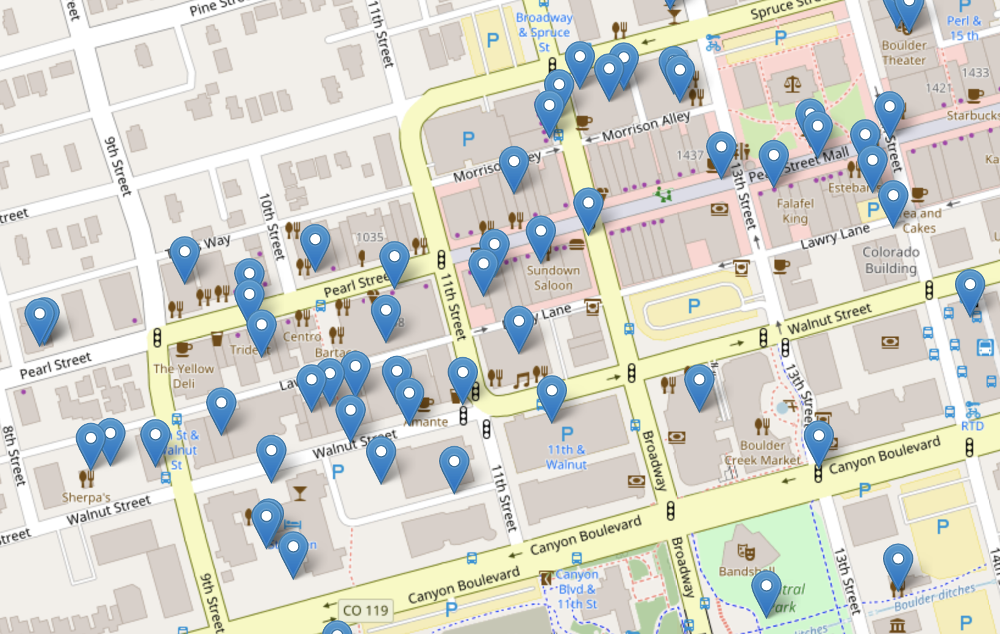

# BoulderView
The goal of this project is to see where people are taking photos in Boulder. In coordination with the City Of Boulder, I will be using Twitter to predict where photos are being taken, based on the text associated with the picture.

## Table of Contents
1. [Data](#data)
   * [Tweets](#tweets)
   * [Gathering Data](#gathering-data)
   * [Building The Dataset](#building-the-dataset)
   * [EDA](#eda)
2. [NLP](#nlp)
3. [The Model](#the-model)
   * [Accuracy](#accuracy)
4. [Web Application](#web-application)

## Data
Originally, I was going to be using a database from the City Of Boulder, but none of the files contained Geocode information. I investigated the APIs of Facebook, Twitter, and Instagram. Facebook wasn't allowing access at the time, and I still haven't heard back from Instagram, but Twitter has been extremely helpful. The API is very easy to use, and provides a wealth of information.

### Tweets
Most people would say that a Tweet is simply anything posted on Twitter (usually text or a picture). In reality, a Tweet contains a great deal of information, ranging from geographic information to the time of the tweet. We call this **metadata**, and it can be extremely useful.

### Gathering Data
I made a data pull every hour, and loaded it into a .txt file, gaining roughly 1000 lines at each pull. I specified my pull to tweets containing information relevant to Boulder, like #Boulder or #FolsomField. Much of this data would be missing information, such as latitude/longitude. Also, many of the rows would be repeats, so I will need to drop them upon reading them into my database. Due to the fact that Twitter only allows me to scrape Tweets up to 1 week ago, my dataset will be relatively small.

### Building The Dataset
After each pull, new data would be added into the dataframe, with any repeats being omitted. The features I'll be using are as follows:
* **ID**: The Tweet ID
* **Type**: Picture, Video, Animated Gif, Other
* **Pic_link**: the link to the picture, if applicable
* **Longitude**: The longitude of the tweet
* **Latitude**: The latitude of the tweet
* **Text**: The text associated with the tweet
* **Hashtags**: The hashtags associated with the tweet
* **Created_At**: The date/time when the tweet was posted
* **Coordinates**: the longitude/latitude coordinates of the tweet

**Figure 1:** A single Tweet in the form of a dictionary, which allows me to gather metadata with ease

## EDA
I dropped all rows where coordinates were NaN, and then grouped the dataframe by coordinates, and found the count of each feature. Then I plotted the results over a map of Boulder, with the size of each marker indicating the number of tweets sent from each location. This created a new dataframe called df_coords, containing the counts of the Type column ("Photo or "Not Photo"). It was helpful for me to get a general idea of where people were sending Tweets. This is the dataframe on which I would base my model.

Made with [Seaborn](https://seaborn.pydata.org/)

Moving forward, I knew I'd be using interactive plots, so I looked into a few:
* [Bokeh](https://bokeh.pydata.org/en/latest/) Useful for Visualization of large datasets
* [Plotly](https://plot.ly/) Creates dashboards for web applications
* [Folium](https://folium.readthedocs.io/en/latest/) Useful for mapping data

Initially, I decided to use Plotly, due to it's ease of use, and ability to interact with webapps. [Here](https://plot.ly/~martychandler13/8.embed) is an early example using Plotly. It's simple to use, and has built-in hover properties. Later however, I switched to Folium, because it allows for interactive maps.

- - - -

# NLP
Before I dive into the model, you should really be familiar with NLP, which stands for Natural Language Processing. It is a field of Computer Science that allows computers to make sense of everyday (human) language ([example](http://www.expertsystem.com/examples-natural-language-processing/)). I will be using NLP, because every Tweet has text associated with it, and I will be able to make predictions regarding a new Tweet based on the text of existing Tweets. The **Text** will act as the link between photos and coordinates.

- - - -

# The Model

I split the data into a training set and a testing set. Using [tfidfVectorizer](https://en.wikipedia.org/wiki/Tf%E2%80%93idf) I created a Matrix of [cosine similarities](https://en.wikipedia.org/wiki/Cosine_similarity). The process of testing the model is as follows:

1. Pull a Tweet from the testing dataset
2. Compute the cosine similarity between the text of that tweet, and the text of all the tweets from the the training dataset.
3. Return the coordinates of the tweet (from the training dataset) that has the highest cosine similarity with the test tweet.
4. Compare the predicted coordinates to the actual coordinates.
5. Repeat 1-4 until a prediction has been made for each Tweet from the testing dataset.
6. Compute the accuracy by dividing the number of correct predictions by the total number of predictions made.

## Accuracy
The average accuracy for my model was around .648, meaning roughly 65% of the time, my model would be able to accurately predict the location of a tweet based on its text. The low accuracy is largely due to the small size of my dataset. As time goes on, and I will be able to collect more Tweets, and the accuracy will increase. I also knew that limiting my score by only considering a prediction to be successful if the actual coordinates equaled the predicted coordinates. I investigated what happened when I defined a success by the actual coordinates being in the top N predictions, instead of just the top prediction:

Points | Accuracy
------ | --------
1      | .648
2      | .712
3      | .745
4      | .763
5      | .775

I made the decision for my model to check the top 3 values and return those coordinates, because it resulted in a 10% increase in accuracy, and the three points are usually pretty close to each other. Here is an example:

 **Interpretation:** we can be 74.5% sure that the Tweet came from one of these three locations

Intuitively, we know that increasing the number of points will increase the accuracy. So why not include 10 points? 30? 100? The answer comes down to practicality. Anyone using this app is trying to figure out the location of a particular Tweet. Yes, increasing the number of point will indeed increase our accuracy (confidence), but it results in larger number of possible points, which is the opposite of what we're trying to do here. It's important to have higher accuracy, but not if it's causing a loss in information. I decided on 3 points, which resulted in higher accuracy, but not at the users expense.

## Using The Model
Once the model was running and I was satisfied with the accuracy, I could pull a random Tweet (picture) and predict it's location based on the associated text.

## Potential Issues/Future Steps
1. Most of the photos I scraped from Twitter didn't have coordinates, so there is really no way for me to verify that whether my model works for the pictures.
2. If the actual location of the photo isn't in my training dataset, my model's prediction will be incorrect. However, there have been cases where I could figure out the location of the photo, and my model's prediction ended up being very close to the actual location.

# Web Application

Home page will have a description of the project and some other information

Prediction Page will make predictions based on a randomly pulled picture from Twitter

Maybe a few others if time.
